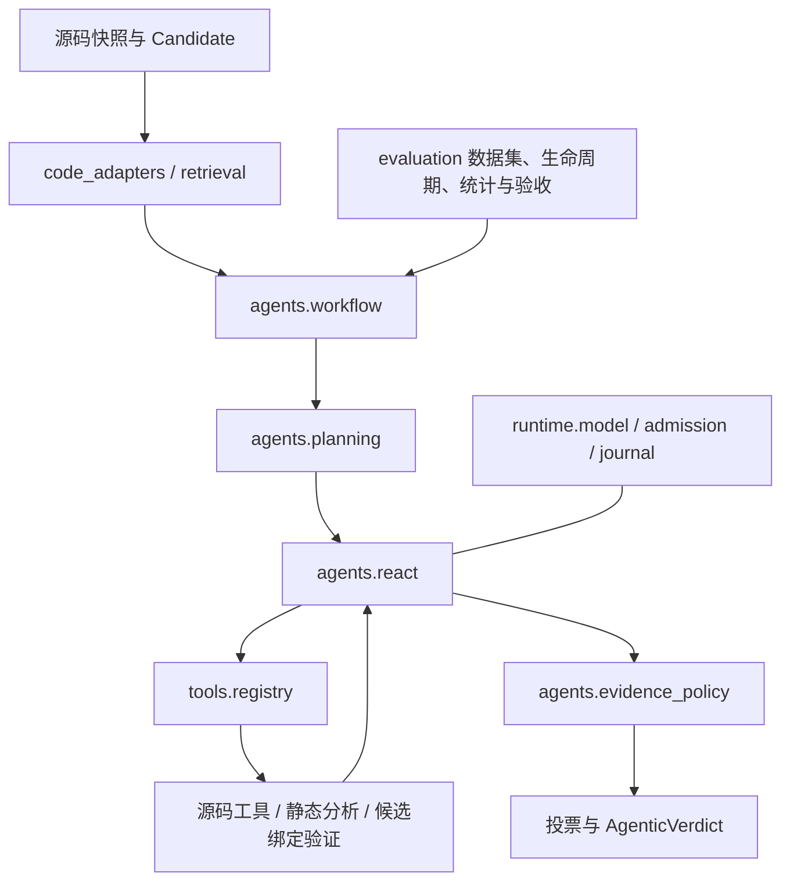

# 架构与阅读路线

当前主线是 E1–E5 候选审查。先读 `domain` 的数据模型，再顺着检索、规划、工具、专家、投票读下去；实验组织和历史基线有独立目录。

## 五步读懂核心

1. `src/cv_agent/domain/types.py`、`evidence.py`、`review.py`：候选、源码、验证 subject、专家票和最终结果。`chat.py` 是模型传输契约。
2. `src/cv_agent/code_adapters/` 和 `retrieval/index.py`：构造文档、解析符号、维护调用边并在预算内检索。Python import root 与原始文件路径分别保存。
3. `src/cv_agent/tools/registry.py`：限制可调用工具、可见路径和累计观察预算；`repository.py` 提供阅读与图查询，`identity.py` 绑定源码与候选身份。
4. `src/cv_agent/agents/react.py` 与 `evidence_policy.py`：模型/工具循环与最终输出的证据要求分开。证据校验不因模型耗尽预算而放宽。
5. `src/cv_agent/agents/workflow.py` 与 `planning.py`：任务依赖、共享观察预算、专家恢复和每专家一张最终票。`harness/defaults.py` 是声明预算和策略的位置。

## 修改应该落在哪里

| 变更 | 所属实现 |
| --- | --- |
| Python / Java AST | `code_adapters/python.py`、`java.py` |
| 图方向、距离排序、文本排名 | `retrieval/index.py` |
| 提示、计划校验 | `agents/planning.py` |
| 模型最终 JSON、引用、验证状态约束 | `agents/react.py`、`evidence_policy.py` |
| 工具名称、输入 schema、能力声明 | `tools/validation/registry.py`、`models.py` |
| 命令和 Python 数据流分析 | `tools/analysis/commands.py`、`python_flow.py` |
| 静态权限、授权、数据流验证 | `tools/validation/permissions.py`、`authorization.py`、`dataflow.py` |
| 动态本地夹具、隔离 | `tools/validation/fixtures.py`、`runtime/fixture_isolation.py` |
| 模型 HTTP、响应解析、usage | `runtime/model.py` |
| 全量测试准入、源码指纹 | `runtime/admission.py` |
| 日志、请求预算、源码快照 | `runtime/journal.py`、`budget.py`、`snapshots.py` |
| 一项候选执行 | `evaluation/execution.py` |
| advisory 门禁/矩阵共同生命周期 | `evaluation/lifecycle.py` |
| 纯汇总与落盘边界 | `evaluation/results.py` |
| 数据集语义、来源及中性描述 | `evaluation/datasets/` |
| 各协议验收与统计 | `evaluation/protocols/`、`metrics.py` |
| 历史确定性基线 | `baselines/workflow.py`、`baselines/experts/` |

## 依赖边界与入口

- 核心 Agent 不依赖操作脚本或确定性基线。共享源码模型、检索、词法基础和投票规则保留共用；扫描器仍用于当前候选发现。
- `evaluation` 组装数据、模型、Agent 和结果；`runtime` 的日志与预算不读取某个实验配置。实验配置解析和凭据加载发生在显式调用时。门禁模块导入时仍读取源码、配置和测试的原始字节以记录初始指纹。
- Python、Java 和其他适配器共用源码文档契约，但保留各自的解析/加载语义。没有为形式统一增加空的抽象基类。
- 扫描规则、基线启发式和验证器承担不同证明责任，不能仅因正则相似就合并语义。
- advisory paired 与 development fixture 协议分开：后者要求的动态验证和候选证据绑定不能在统一入口时消失。
- 根目录只保留 `__init__.py` 和 `cli.py`。旧转发模块、旧 `experts/`、旧 `validation_tools/` 以及 `runtime/execution.py` 已删除；使用 `baselines/experts/`、`tools/validation/` 和 `evaluation/execution.py`。测试替换依赖时直接 patch 实现模块。
- 顶层包惰性导出少量公共对象，导入主 Agent 不会加载确定性基线。`cv-agent` CLI 和 shell 入口保留；旧 Python 模块导入及旧 `python -m` 模块地址已经退场。

## 回归验证

本次重构逐批添加测试，并在开始下一批前跑完整离线套件。冻结检查覆盖端到端 scripted 输出、模型 JSON schema、planner 提示、工具定义、验证 subject、解析器路径与符号、入口调用以及运行异常收尾。完整记录见 [重构记录](history/records/REFACTOR_2026-09-21.md)。

这些检查保留已观察行为，不能证明静态分析覆盖了 Python 的全部语义。已经发现的权限和 shell 分析问题仍需单独添加修复测试；详见 [当前状态](CURRENT_STATUS.md)。

操作入口见 [scripts 使用说明](../scripts/README.md)。四个 shell 命令保留原用途，47 个 Python 转发文件已删除；实验、准备和诊断直接调用所属包模块。两份目标解释器探针位于 `scripts/probes/`，由对应 reproduction runner 按文件路径启动，不依赖安装 cv_agent。

配置入口见 [配置导航](../configs/README.md)。`evaluation/datasets/composition.py` 为当前门禁、矩阵与 v4 审计加载共用数据集及明确指定的 profile，随后进入原有类型校验和生命周期；其他专项协议保持独立。
